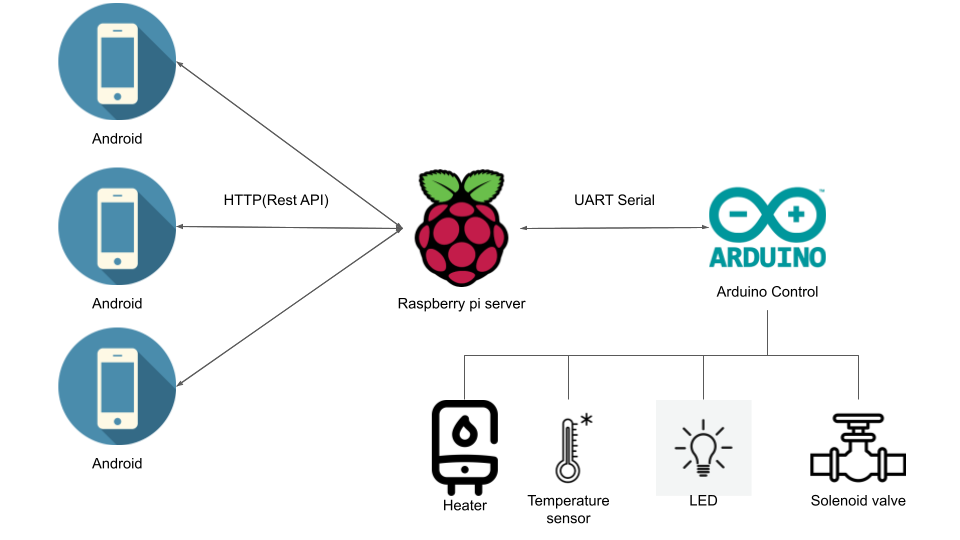
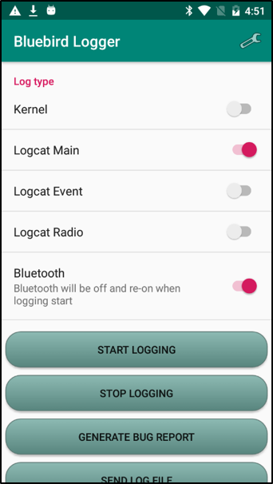
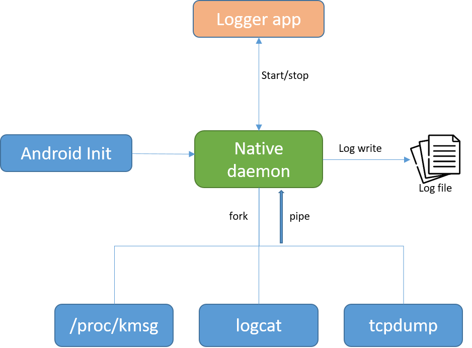
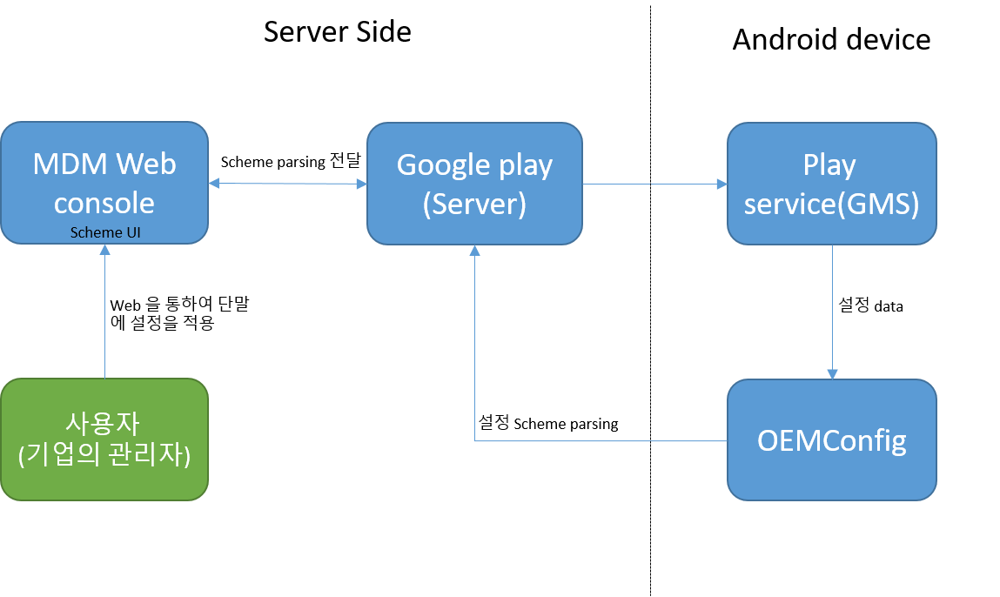

# 서명수
코드의 performance 를 중요시하고, 항상 새로운 기술을 배우고 적용하려고 하는 개발자 입니다.

## RemoteCall
리모트콜은 웹, PC app 에서 안드로이드 단말을 원격제어 할 수 있는 서비스 입니다.

**사용기술**: MVVM, Rxjava, retrofit, WebRTC

<a href="https://play.google.com/store/apps/details?id=com.rsupport.remotecall.rtc.host">

 
Play store page
</a>

## RS Assistant
Plugin:RSAssistant 는 알서포트가 제공하는 원격 기반 서비스(원격지원, 원격제어, 화상회의 등)를 이용할 때 '화면 제어' 기능을 활성화하기 위하여 설치하는 플러그인 앱입니다.  
**제어**(Key injection) 을 위하여 Accessibility service 이 사용됩니다.

**사용기술**: MVVM, Coroutine, Kotlin flow, Compose, Retrofit, Navigation

<a href="https://play.google.com/store/apps/details?id=com.rsupport.android.plugin.assistant">

 
Play store page
</a>

## 모비즌 스크린 레코더
화면을 녹화하는 android app 입니다.

**사용기술**: Room, Coroutine, Rxjava, Retrofit, MediaProjection  
<a href="https://play.google.com/store/apps/details?id=com.rsupport.mvagent">

 
Play store page
</a>

## FishTank (개인)
[GItHub link](https://github.com/msseo91/FishTank)  
어항의 환수, 조명, 수온 등을 센서, 아두이노, 라즈베리파이 를 이용하여 안드로이드 앱으로 제어하는 프로젝트 입니다.
- Solanoid valve open/close 제어로 환수 자동화.  
- 조명 밝기 0~100% 제어  
- 수온 모니터링
- 히터를 수온센서와 연동하여 정확하게 수온유지

**사용기술**: MVVM, Coroutine, Kotlin flow, Compose, Arduino, JSP(Spring), MariaDB

## Logger
Android OS 에서 이슈 발생시 로그 취득을 목적으로 하는 app 입니다.  
Android logcat 뿐만 아니라 kernel message, bluetooth log, tcpdump 도 지원합니다.  
Native service 는 C++, app 은 java/kotlin 으로 개발 되었습니다.

**사용기술**: Android app(SDK), C++, framework(system service), System property, native service.  

<table>
    <tr>
        <td>
            

                
                 
                App screenshot
            

        </td>
        <td>
            

                
                 
                Logger Structure
            

        </td>
    </tr>
</table>

## OEMConfig
OEMConfig 는 OEM(단말 제조사)에서 제공하는 Android Enterprise 솔루션 입니다.  
일반적으로 단말의 설정(wifi, 화면밝기 등)의 제어에 대한 접근을 DeviceAdmin(기기 관리자) 에게 제공합니다.  
[DeviceAdminPolicyManager](https://developer.android.com/reference/android/app/admin/DevicePolicyManager)
에서 제공하지 않는 기능을 OEM 에서 제공하기 위해 Google 에서 표준으로 제작하였습니다.  
대표적으로 삼성단말에서는 [Knox](https://www.samsungknox.com/en/solutions/it-solutions/knox-platform-for-enterprise) 로 제공됩니다.

